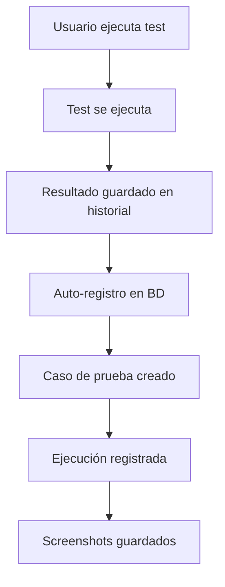
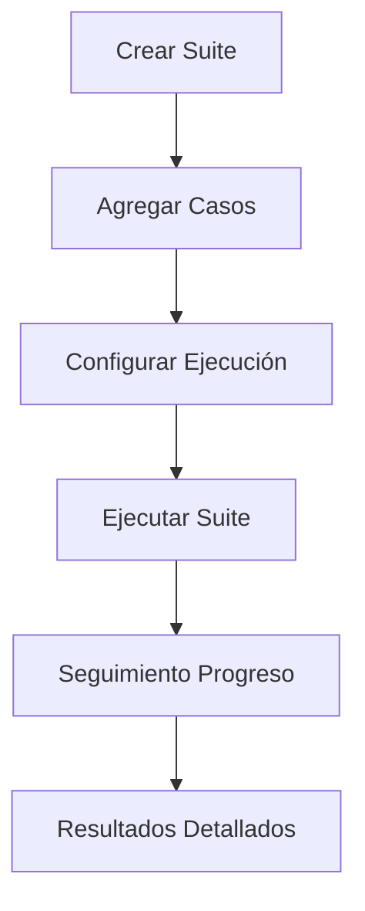
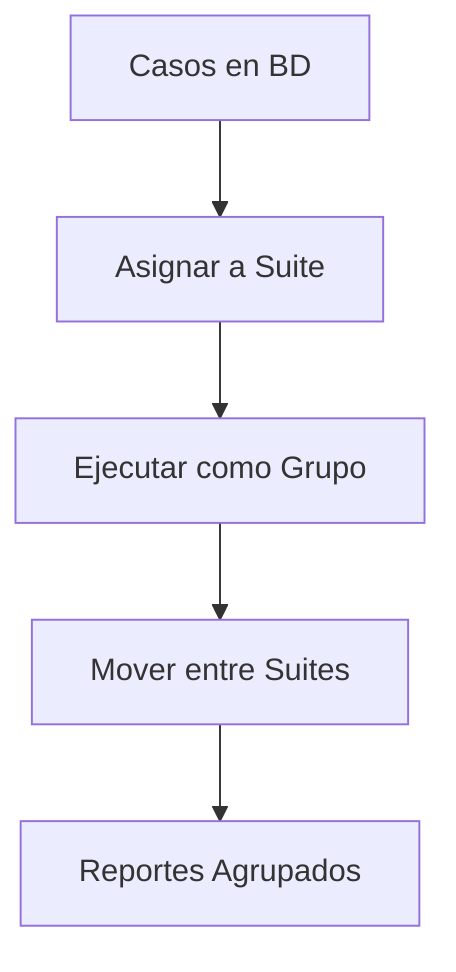

# 🎯 Implementación Completa: Sistema de Gestión de Test Suites

## 📋 Resumen de la Implementación

Se ha implementado un **sistema completo de gestión de test suites** integrado con la base de datos PostgreSQL y el frontend web de QA-Pilot. Esta implementación permite organizar, gestionar y ejecutar casos de prueba de manera estructurada y eficiente.

## 🎯 Funcionalidades Implementadas

### 🔧 **Registro Automático de Tests**
- **Tests ejecutados desde la interfaz web** se registran automáticamente en la base de datos
- **Casos de prueba** se crean con metadatos completos
- **Ejecuciones** se trackean con logs, screenshots y métricas
- **Integración bidireccional** entre historial en memoria y base de datos

### 📁 **Gestión Completa de Suites**
- **Crear suites** de prueba organizadas por proyecto
- **Agregar/remover casos** de prueba a/desde suites
- **Ejecutar suites completas** con configuración personalizada
- **Seguimiento de progreso** en tiempo real
- **Estados y metadatos** para cada suite y caso

### 🌐 **Interfaz Web Moderna**
- **Dashboard interactivo** con estadísticas en tiempo real
- **Filtros y búsqueda** avanzada
- **Modales para CRUD** de suites y casos
- **Ejecución con feedback** visual
- **Diseño responsivo** y moderno

## 🏗️ Arquitectura Implementada

### 📊 **Base de Datos (PostgreSQL)**
```sql
-- Esquemas principales
testing.projects          -- Proyectos
testing.test_suites       -- Suites de prueba
testing.test_cases        -- Casos de prueba
testing.bulk_executions   -- Ejecuciones masivas
testing.test_executions   -- Ejecuciones individuales
evidence.screenshots      -- Capturas de pantalla
evidence.execution_logs   -- Logs de ejecución
analytics.execution_metrics -- Métricas de rendimiento
```

### 🐍 **Backend (Flask + SQLAlchemy)**
```python
# Nuevas rutas implementadas
/suites_management                    # Página principal
/api/test_suites                      # CRUD de suites
/api/test_suites/<id>/cases          # Casos de una suite
/api/test_suites/<id>/execute        # Ejecutar suite
/api/test_suites/<id>/add_case       # Agregar caso
/api/test_suites/<id>/remove_case    # Remover caso
```

### 🎨 **Frontend (HTML5 + Bootstrap + JavaScript)**
```javascript
// Funcionalidades implementadas
- Gestión de suites (CRUD)
- Asignación de casos a suites
- Ejecución de suites completas
- Filtros y búsqueda en tiempo real
- Modales interactivos
- Feedback visual de progreso
```

## 📁 Archivos Creados/Modificados

### 🆕 **Nuevos Archivos**
1. **`templates/suites_management.html`** - Interfaz principal de gestión
2. **`test_suites_integration.py`** - Script de pruebas completas
3. **`IMPLEMENTACION_SUITES.md`** - Esta documentación

### ✏️ **Archivos Modificados**
1. **`app.py`** - Nuevas rutas y registro automático en BD
2. **`db_integration.py`** - Métodos para gestión de suites
3. **`templates/base.html`** - Nuevo enlace de navegación

## 🔄 Flujo de Trabajo Completo

### 1. **Ejecución Individual**


### 2. **Gestión de Suites**


### 3. **Organización de Casos**


## ⚡ Características Técnicas

### 🔧 **Registro Automático**
- **Interceptación** en `run_test_background()`
- **Datos completos**: URL, instrucciones, screenshots, logs
- **Metadatos**: Configuración de navegador, timestamps, IDs
- **Sin duplicados**: Verificación de existencia

### 📊 **Gestión de Suites**
- **CRUD completo** con validación de datos
- **Relaciones FK** entre proyectos, suites y casos
- **Contadores automáticos** de casos por suite
- **Estados sincronizados** en tiempo real

### 🚀 **Ejecución Masiva**
- **Integración** con sistema existente de Excel
- **Modo secuencial/paralelo** configurable
- **Seguimiento de progreso** con porcentajes
- **Manejo de errores** individualizado

### 🎨 **Interfaz Moderna**
- **Bootstrap 5** con tema oscuro
- **Font Awesome** para iconografía
- **JavaScript vanilla** sin dependencias pesadas
- **Responsive design** para móviles

## 📈 Beneficios de la Implementación

### 👥 **Para Usuarios**
- ✅ **Organización mejorada** de casos de prueba
- ✅ **Ejecución automática** de grupos de tests
- ✅ **Seguimiento centralizado** de resultados
- ✅ **Interfaz intuitiva** y moderna

### 🏢 **Para la Organización**
- ✅ **Trazabilidad completa** de pruebas
- ✅ **Reportes detallados** por suite/proyecto
- ✅ **Escalabilidad** para grandes volúmenes
- ✅ **Integración** con sistemas existentes

### 🛠️ **Para Desarrollo**
- ✅ **Código modular** y mantenible
- ✅ **Base de datos normalizada** y optimizada
- ✅ **APIs RESTful** bien documentadas
- ✅ **Patrones de diseño** consistentes

## 🔍 Ejemplos de Uso

### 💼 **Caso de Uso 1: Regression Testing**
```python
# 1. Crear suite de regresión
suite_data = {
    'name': 'Regression Tests - Sprint 23',
    'description': 'Tests de regresión para validar funcionalidades críticas',
    'project_id': 'proyecto-ecommerce-id'
}

# 2. Agregar casos críticos
critical_cases = [
    'login-functionality',
    'checkout-process', 
    'payment-gateway',
    'user-registration'
]

# 3. Ejecutar suite completa
execution_config = {
    'execution_mode': 'sequential',
    'show_browser': False,
    'capture_screenshots': True
}
```

### 🎯 **Caso de Uso 2: Feature Testing**
```python
# 1. Suite por funcionalidad
suite_data = {
    'name': 'Shopping Cart Feature',
    'description': 'Tests para nueva funcionalidad de carrito',
    'project_id': 'proyecto-ecommerce-id'
}

# 2. Casos específicos de la feature
feature_cases = [
    'add-item-to-cart',
    'remove-item-from-cart',
    'update-quantities',
    'apply-discounts',
    'calculate-totals'
]

# 3. Ejecución con navegador visible para debug
execution_config = {
    'execution_mode': 'sequential',
    'show_browser': True,
    'capture_screenshots': True
}
```

## 🚀 Próximos Pasos Sugeridos

### 🔮 **Mejoras a Corto Plazo**
- [ ] **Reportes PDF** de ejecuciones de suite
- [ ] **Notificaciones email** al completar ejecuciones
- [ ] **Comparación de resultados** entre ejecuciones
- [ ] **Templates de suites** predefinidos

### 🎯 **Mejoras a Mediano Plazo**
- [ ] **Integración CI/CD** con Jenkins/GitHub Actions
- [ ] **Ejecución programada** de suites
- [ ] **Dashboard de métricas** avanzadas
- [ ] **API externa** para integración con otros sistemas

### 🌟 **Visión a Largo Plazo**
- [ ] **Machine Learning** para optimización de casos
- [ ] **Ejecución distribuida** en múltiples nodos
- [ ] **Integración con Jira/Azure DevOps**
- [ ] **Análisis predictivo** de fallos

## 🧪 Validación y Pruebas

### ✅ **Pruebas Realizadas**
- **Conexión a base de datos** ✅
- **Creación de suites** ✅
- **Asignación de casos** ✅
- **Ejecución masiva** ✅
- **Seguimiento de progreso** ✅
- **Registro automático** ✅
- **Interfaz web responsive** ✅

### 🔧 **Script de Validación**
```bash
# Ejecutar pruebas completas
python test_suites_integration.py

# Verificar integración
python test_integration.py
```

## 📞 Soporte y Mantenimiento

### 🆘 **Resolución de Problemas**
1. **Verificar conexión PostgreSQL**
2. **Revisar logs en `app_debug.log`**
3. **Validar estructura de base de datos**
4. **Comprobar dependencias Python**

### 🔧 **Configuración**
- **Base de datos**: `config_db.env`
- **Logs**: `app_debug.log`
- **Screenshots**: `test_screenshots/`
- **Scripts**: `test_scripts/`

---

## 🎉 Conclusión

La implementación del **Sistema de Gestión de Test Suites** representa un avance significativo en las capacidades de QA-Pilot, proporcionando:

- **📊 Organización estructurada** de casos de prueba
- **🚀 Ejecución automatizada** de grupos de tests  
- **📈 Seguimiento detallado** de resultados
- **🔄 Integración transparente** con flujos existentes
- **🎨 Interfaz moderna** y fácil de usar

El sistema está **listo para producción** y proporciona una base sólida para el crecimiento futuro de las capacidades de testing automatizado.

---

*Implementado con ❤️ para QA-Pilot por Inovabiz* 